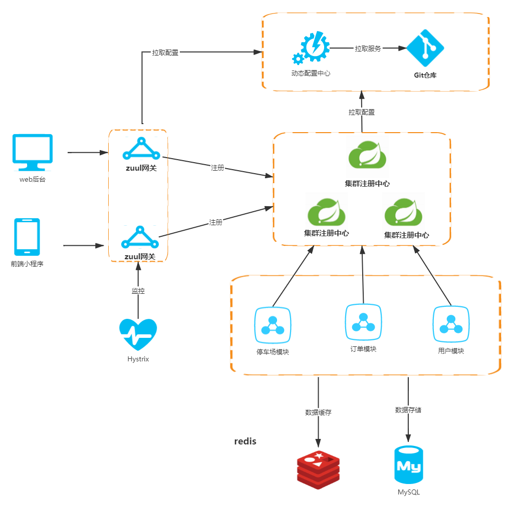
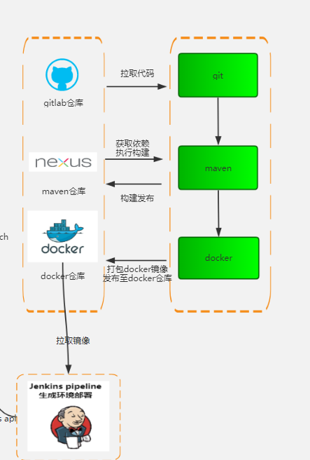

# [Microservice-Cloud](https://github.com/Gakki90/Microservice-Cloud) 

## 1.1 简介

 [Microservice-Cloud](https://github.com/Gakki90/Microservice-Cloud) 是一个微服务架构的停车微信小程序，核心功能是帮助用户找到附近停车场的信息，还为停车场管理员增加了后台管理系统，用于管理停车场。

## 1.2 项目架构图

1. 总体架构图

    

2. 项目部署图

 

3. 小程序登录流程

   

## 1.3 页面展示

1. 登录界面

   

2. 管理员后端
     

3. 服务注册中心

   

## 1.4 项目技术栈

后端技术栈：

* Netflix eureka 用于服务注册与服务治理

*  Ribbon：用于客户端负载均衡

* Feign：声明式服务调用，用于不用微服务之间接口的调用

*  Hystrix: 服务熔断保护

* Zuul：服务网关，统一管理所有微服务的接口，身份验证

* Config：分布式配置中心，项目的配置文件统一托管在github上
* redis：数据缓存，session存储
* docker：项目运行平台
* jenkins：持续集成

前端技术栈：

1. 微信小程序
2. 前端框架layui

